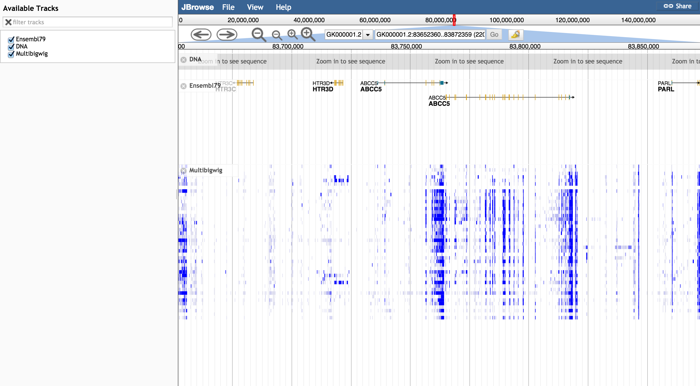
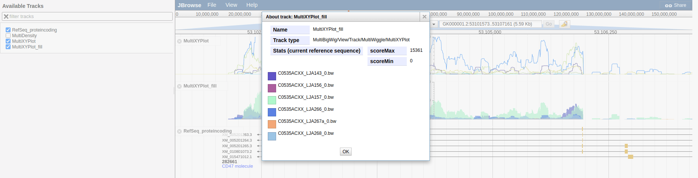

# multibigwig

A JBrowse plugin for plotting multiple bigwig files on a single track. Includes a storeclass
that accepts multiple bigwig URLs and a custom tracktype for rendering the subtracks.

Figure with MultiDensity and MultiXYPlot with different group colorings

## Example configs

Example for trackList.json (MultiDensity as example)

      {
         "storeClass" : "MultiBigWig/Store/SeqFeature/MultiBigWig",
         "urlTemplates" : [
            {"url":"bw/C0535ACXX_LJA288_0.bw","name":"C0535ACXX_LJA288_0", "color": "red"},
            {"url":"bw/C0535ACXX_LJA38_0.bw","name":"C0535ACXX_LJA38_0", "color": "red"},
            {"url":"bw/C0535ACXX_LJA96_0.bw","name":"C0535ACXX_LJA96_0", "color": "red"},
            {"url":"bw/D09A8ACXX_LJA201_0.bw","name":"D09A8ACXX_LJA201_0", "color": "green"},
            {"url":"bw/D09A8ACXX_LJA232a_0.bw","name":"D09A8ACXX_LJA232a_0", "color": "green"},
            {"url":"bw/D09A8ACXX_LJA233_0.bw","name":"D09A8ACXX_LJA233_0", "color": "green"},
            {"url":"bw/D09A8ACXX_LJA234b_0.bw","name":"D09A8ACXX_LJA234b_0", "color": "green"},
            {"url":"bw/D09A8ACXX_LJA236_0.bw","name":"D09A8ACXX_LJA236_0", "color": "green"},
            {"url":"bw/D09A8ACXX_LJA237_0.bw","name":"D09A8ACXX_LJA237_0", "color": "green"},
            {"url":"bw/D09A8ACXX_LJA240_0.bw","name":"D09A8ACXX_LJA240_0", "color": "green"},
            {"url":"bw/D09A8ACXX_LJA241_0.bw","name":"D09A8ACXX_LJA241_0", "color": "green"}
         ],
         "showTooltips": true,
         "label" : "Multibigwig",
         "type" : "MultiBigWig/View/Track/MultiWiggle/MultiDensity"
      }

Example for tracks.conf (MultiXYPlot as example)

    [tracks.multibigwigxy]
    key=RNA-seq BigWig XY
    type=MultiBigWig/View/Track/MultiWiggle/MultiXYPlot
    style.height=100
    storeClass=MultiBigWig/Store/SeqFeature/MultiBigWig
    max_score=400
    autoscale=global
    urlTemplates+=json:{"url":"bw/C0535ACXX_LJA276_0.bw", "name": "C0535ACXX_LJA276_0.bw", "color": "#235"}
    urlTemplates+=json:{"url":"bw/C0535ACXX_LJA288_0.bw", "name": "C0535ACXX_LJA288_0.bw", "color": "#a54"}
    urlTemplates+=json:{"url":"bw/C0535ACXX_LJA38_0.bw", "name": "C0535ACXX_LJA38_0.bw", "color": "#ae2"}
    urlTemplates+=json:{"url":"bw/C0535ACXX_LJA96_0.bw", "name": "C0535ACXX_LJA96_0.bw", "color": "#339"}
    urlTemplates+=json:{"url":"bw/D09A8ACXX_LJA201_0.bw", "name": "D09A8ACXX_LJA201_0.bw", "color": "#156"}
    urlTemplates+=json:{"url":"bw/D09A8ACXX_LJA235_0.bw", "name": "D09A8ACXX_LJA235_0.bw", "color": "#918"}

Simple config using just array of filenames available since version 0.10 of this plugin

    [tracks.multibigwigxy]
    key=RNA-seq BigWig XY
    type=MultiBigWig/View/Track/MultiWiggle/MultiXYPlot
    storeClass=MultiBigWig/Store/SeqFeature/MultiBigWig
    randomizeColors=true
    colorizeAbout=true
    urlTemplates+=bw/C0535ACXX_LJA276_0.bw
    urlTemplates+=bw/C0535ACXX_LJA288_0.bw
    urlTemplates+=bw/C0535ACXX_LJA38_0.bw
    urlTemplates+=bw/C0535ACXX_LJA96_0.bw
    urlTemplates+=bw/D09A8ACXX_LJA201_0.bw
    urlTemplates+=bw/D09A8ACXX_LJA235_0.bw

Same thing in trackList.json

      {
         "storeClass" : "MultiBigWig/Store/SeqFeature/MultiBigWig",
         "urlTemplates" : [
            "bw/C0535ACXX_LJA288_0.bw",
            "bw/C0535ACXX_LJA38_0.bw",
            "bw/C0535ACXX_LJA96_0.bw",
            "bw/D09A8ACXX_LJA201_0.bw",
            "bw/D09A8ACXX_LJA232a_0.bw",
            "bw/D09A8ACXX_LJA233_0.bw",
            "bw/D09A8ACXX_LJA234b_0.bw",
            "bw/D09A8ACXX_LJA236_0.bw",
            "bw/D09A8ACXX_LJA237_0.bw",
            "bw/D09A8ACXX_LJA240_0.bw",
            "bw/D09A8ACXX_LJA241_0.bw"
         ],
         "showTooltips": true,
         "label" : "Multibigwig",
         "type" : "MultiBigWig/View/Track/MultiWiggle/MultiDensity"
      }

## Options

### Main configuration

- urlTemplates - An array of subtracks, containing the url for a BW file, name, and optionally color for subtrack labels. Each one can have the following properties:

  - name (name or label for the subtrack)
  - description (extended description)
  - color (a color for the line)
  - nonCont (discontinuous drawing of the line, or "pointillism" style)
  - url (a URL to a bigwig file)
  - lineWidth (a number)
  - storeClass (alternative to URL that allows full storeClass initialization, see below)

Example

    "urlTemplates": [
        { "name": "sample1", "description": "liver", "color": "red", "nonCont": true, "url": "sample1.bw" }
    ]

The configuration can also specify a storeClass if something other than BigWig is used

    urlTemplates+=json:{"storeClass": "JBrowse/Store/SeqFeature/BedGraphTabix", "url":"volvox_microarray.bg.gz", "name": "volvox_positive", "color": "#235"}
    urlTemplates+=json:{"storeClass": "JBrowse/Store/SeqFeature/BedGraphTabix", "url":"volvox_microarray_negative.bg.gz", "name": "volvox_negative", "color": "#a54", "lineWith": 3}

Note BedGraph is still unimplemented on JBrowse master but will be soon

### Attributes inherited from Wiggle tracks

- style->height - Total height of the track
- autoscale - Can be global or local. Global is the max of all bigwig tracks globally. Local is same thing but local, so scrolling around with autoscale local takes time for large number of bigwigs. Note: track types can adjust autoscale type via the track menu
- max_score - The max score to use. If autoscale global is used, max_score overrides. Note, track types can adjust max score via the track menu

### MultiDensity specific options

- showLabels - Display subtrack labels (boolean)
- showTooltips - Display tooltips with subtrack name and description (boolean)
- clickTooltips - Only display tooltip if clicked instead of mouseovered
- labelFont - Specify subtrack label font CSS e.g. "6px sans-serif"
- labelWidth - Specify a specific width for all subtrack labels. Default autosizes to each sublabel's length, which can look ugly

### Other options

- randomizeColors - Randomize the colors to be used on each subtrack to help distinguish MultiXYPlot lines
- colorizeAbout - Add subtrack colors to the 'About this track' menu
- useStdDev - an option that uses the 3 standard deviations above the mean as the scoreMax and sets scoreMin to 0

## Filled histograms

If you specify both nonCont: true and fill: true then you can get overlaid bargraphs, which if using an alpha color, can show multiple at a time better

## Install

- Clone repo into plugins folder in JBrowse and name folder MultiBigWig
- Add "plugins": ["MultiBigWig"] to trackList.json or jbrowse_conf.json

Please see http://gmod.org/wiki/JBrowse_FAQ#How_do_I_install_a_plugin for more information about installing plugins

Still in beta! Feel free to provide feedback
